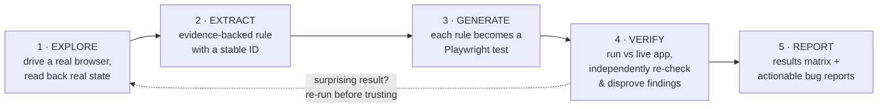

# AI-Assisted Business Rules Extraction & Test Generation

**What this is:** A repeatable, tool-supported method for discovering the business rules
hidden inside a live web application, turning those rules into automated tests, and producing
evidence a person can act on.

**Who this is for:** Project managers and testers who want to understand what the process
does, why it is trustworthy, and how it applies beyond the one application we built it on.

**Status:** Proven on a real application (Asteron Life Quote & Apply, an OutSystems insurance
form). The same method is designed to point at other sites, applications, and screens — see
"Reusing this on a new application" below.

---

## 1. The problem it solves

Most business-critical web applications have a large amount of logic baked into them — age
limits, dollar caps, calculation formulas, discount thresholds, field dependencies, "you can't
select X unless Y" rules. That logic is what the business actually runs on, but it is often:

- **Undocumented**, or documented from an out-of-date design spec that no longer matches the app.
- **Locked inside code** we can't see (third-party platform, vendor build, low-code tool).
- **Only knowable by clicking through the app by hand** — slow, inconsistent, and easy to get wrong.

The result: nobody has a reliable, complete, *tested* map of how the application behaves, and
regressions slip through because there's nothing automatically checking that behavior hasn't changed.

This method produces exactly that map — and keeps it honest over time.

---

## 2. The process at a glance

*(If your viewer doesn't render Mermaid, the flow is simply: Explore → Extract → Generate →
Verify → Report, with Verify looping back to re-run anything surprising before it's trusted.)*

Each stage produces a durable artifact that the next stage builds on. Nothing is thrown away —
the evidence trail is part of the deliverable.

---

## 3. The five stages in detail

### Stage 1 — Explore the application

An AI assistant drives a **real, headed browser** against the live application through a small
command server. It reads back the actual page state — every field, dropdown, button, checkbox,
validation error, and modal — and interacts one step at a time, exactly as a real user would.
It deliberately probes edge cases: oversized values, boundary numbers, invalid inputs,
cross-field combinations.

- **Why the live app, not the source code?** The application is built on OutSystems (a low-code
  platform); we don't have access to its compiled source. So the app's *actual behavior*, observed
  directly, is our source of truth.
- **What comes out:** raw observations — "when I entered $700k income, the Income Protection
  benefit capped at $30,000/month"; "selecting cover X without cover Y produced this exact error."

### Stage 2 — Extract the rules

Observations are written up as **business rules**, each with a **stable ID** (e.g. `LSC-07`,
`DC-15`, `ADV-08`) so it can be cited in tickets, tests, and reviews instead of re-described
every time. Rules are grouped by screen area (Personal Details, Lump Sum Covers, Disability
Covers, Premium & Bundling, and so on).

Every rule records *what was observed and how*, not a guess. Where two exploration sessions
disagreed, that conflict is recorded openly and resolved with a follow-up probe rather than
silently picking one.

- **What comes out:** a human-readable rulebook (the "business rules" pages) that a business
  analyst or developer can read without touching the app.

**Example — one real rule as recorded (`DC-15`, Disability Covers):**

> **Maximum monthly benefit = 45% × Pre-tax Annual Income ÷ 12, hard-capped at $7,500/month**
> (Agreed Value Plus basis). Confirmed exact: income $150,000 → max $5,625/month; income
> $200,000 → max $7,500/month; income $320,000 → still $7,500/month (cap applies). Exact error
> text: *"The maximum remaining monthly benefit for Mortgage and Living Cover Agreed Value Plus
> is $7,500."* *(Corrected 2026-08-19: previously documented as an uncapped formula. Live
> testing at multiple income levels revealed the $7,500 hard cap.)*

Note what this captures: a stable ID, the exact formula and cap, the specific values it was
confirmed at, the verbatim error string, and a dated correction of what the old documentation
got wrong. That's the difference between a guess and evidence.

### Stage 3 — Generate the tests

Each confirmed rule becomes a **self-contained automated test** (Playwright). The test drives
the live app the same way exploration did, and asserts the rule holds. Tests are written to
cover not just one happy path but the full space that matters: multiple income levels across a
formula, exact dollar boundaries, the same rule re-checked across different customer profiles
(age / gender / occupation) to prove it's universal, and cross-rule interactions.

- **What comes out:** a runnable test suite. Drop a test file into any Playwright project and
  it runs. If the app's behavior ever drifts, the test goes red.

### Stage 4 — Verify, and actively try to disprove findings

This is the stage that makes the whole thing trustworthy, and it's where the method is
deliberately stricter than typical testing.

- Tests are run against the live app and must pass (or, when testing a not-yet-correct feature
  against its spec, must fail *for the documented reason* until the real defect is fixed).
- **A single surprising result is treated as a lead, not a finding.** Before anything is written
  up as a defect, it is re-run with a different, minimal script, sampled over time if timing
  could matter, and only accepted once two or more independent clean runs agree.
- We hunt for **self-inflicted false alarms** — cases where the *test's own technique*
  accidentally caused the result. Real examples we caught and retracted: a stray mouse-scroll in
  a script silently changed a dropdown value and looked like a bug; testing several scenarios
  back-to-back on one record let an old value leak into the next and looked like a wrong default.
  Both were disproven before they reached anyone.

There are supporting tools for this stage (an independent re-verification engine, a safety
linter that flags risky interaction patterns) so the discipline is enforced, not just hoped for.

- **What comes out:** confidence. Findings that survive this stage are real.

### Stage 5 — Report results

Every test run produces a **results matrix** (one row per rule: what was tested, expected,
actual, pass/fail) and, where a genuine defect is confirmed, a **bug report** written for
someone with zero context on our tooling — exact reproduction steps, expected vs. actual, and
embedded screenshots.

- **What comes out:** artifacts a PM or developer can act on directly, plus a full evidence
  trail (including the runs where we proved ourselves wrong).

**Example — a real results matrix from a live run** (Disability Covers, run 2026-08-26):

| Test | Status | Duration |
|---|---|---|
| DC-33: Business Expenses maximum monthly benefit is a flat $16,666 | ✅ passed | 215.8s |
| DC-39: Business Disability maximum monthly benefit is a flat $50,000 | ✅ passed | 215.0s |
| DC-06/DC-44: Farmers Disability requires Self-Employed/Own-company AND a flat $10,000 cap | ✅ passed | 230.0s |

Each row is a real business rule, checked against the live application, green. If any of these
behaviors changed unexpectedly in a future release, the corresponding row would turn red.

---

## 4. Two ways we use it (and why the difference matters)

The method runs in one of two modes depending on whether a written spec exists:

| Mode | Starting point | "Correct" is defined by | A mismatch means |
|---|---|---|---|
| **Reverse-engineering** | No spec — the app is a black box | The app's own behavior | An undocumented quirk to record |
| **Acceptance-criteria** | A written user story with numbered ACs | The written requirement | A candidate **defect** in the app |

The distinction is important for testers: in acceptance-criteria mode, when the app disagrees
with the spec, we do **not** quietly rewrite the test to match the app — the app may be the one
that's wrong. We encode the test to the *spec's* expected value, so the suite automatically
turns green the moment the real defect is fixed.

---

## 5. Why this is valuable to the business

- **A tested map of how the app really behaves** — not a stale design doc. Confidence in what
  the product actually does today.
- **Automatic regression protection** — if a future change alters a business rule unexpectedly,
  a test goes red instead of a customer finding out.
- **Findings you can trust** — the "disprove it first" discipline means fewer false alarms
  wasting developer time, and real defects come with reproducible evidence.
- **Faster onboarding & shared language** — stable rule IDs give BAs, testers, and developers a
  common vocabulary ("this covers LSC-07") instead of re-explaining rules in every ticket.
- **Reusable** — the same method and tooling point at any web application, not just the one we
  started with.

---

## 6. Reusing this on a new application

The exploration server, batch runner, verification engine, reporter, and safety tooling are
**application-agnostic** — they work against any web app you point them at. Adopting the method
for a new site/screen follows the same five stages:

1. **Add the app** — create a folder for it, provide its URL and a test login.
2. **Explore** — start the browser command server against the target, log in, and let the AI
   drive discovery.
3. **Extract & generate** — write up the rules with IDs; turn each into a test.
4. **Verify** — run against the live app, disprove surprises, confirm findings.
5. **Report** — results matrices and bug reports land in a per-run folder automatically.

The only genuinely app-specific pieces are: the login step, the interaction quirks of that
platform (e.g. how a particular framework handles masked number fields), and the rules
themselves. Everything else is reused as-is.

---

## 7. What has actually been done (proof point)

On the Asteron Life Quote & Apply form (an OutSystems application), this method produced:

- A full, evidence-based business-rules map of the main Quote screen, organized by area with
  stable IDs.
- Automated test coverage across five core areas — age boundaries, lump sum cover caps,
  disability cover formulas, premium/bundling discounts, and policy/kids-cover rules — each
  running dozens of checks and passing consistently against the live environment.
- Acceptance-criteria testing of a newer commission-category feature against its written user
  story, including confirmed regressions written up as actionable bug reports.
- A documented track record of **catching our own false alarms before reporting them** — the
  clearest evidence of how carefully findings are checked.

An exhaustive boundary analysis maps hundreds of discovered rules to fields and test scenarios.

---

## 8. Current constraints & limitations

Being upfront about where the method has edges today:

- **Network access.** The automated tests currently run reliably only from an approved internal
  workspace. The client's own automated test runner isn't yet permitted to reach the test
  environment over the network (the environment is restricted to whitelisted IPs). This is an
  access/whitelisting decision, not a limitation of the method itself — once the runner is
  allowed through, the same tests run unchanged.

- **On "finding bugs that turned out not to be bugs."** Part of the process is *deliberately*
  trying to disprove a finding before reporting it, and on this project two apparent defects were
  correctly retracted after that check. This is a feature, not a miss: it means false alarms are
  caught internally rather than sent to developers to chase. The trade-off is that confirming a
  surprising result takes more than a single run — we treat one run as a lead and require two or
  more independent clean runs before writing anything up. We consider that time well spent,
  because a false "defect" wastes more of everyone's time than the extra verification does.

- **Depth varies by area.** On the proof-point application, the main Quote screen was tested
  exhaustively and adversarially; the multi-step application flow that follows it has only been
  explored once, lightly, and is the next area to bring up to the same rigor.

- **A few checks are deliberately deferred.** Some scenarios would require changing a setting
  shared across a whole agency, or saving real records, in a shared test environment — those are
  held pending a decision rather than run blindly.

---

*This document is a high-level description of the method. The living rulebook, test
documentation, and evidence artifacts referenced above are maintained alongside the code.*
